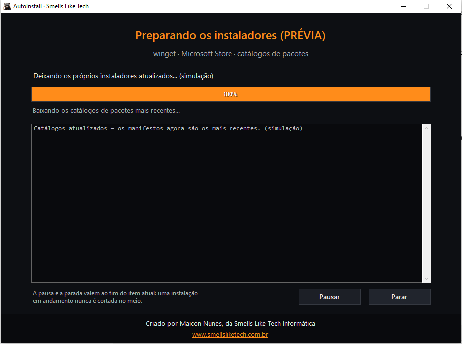
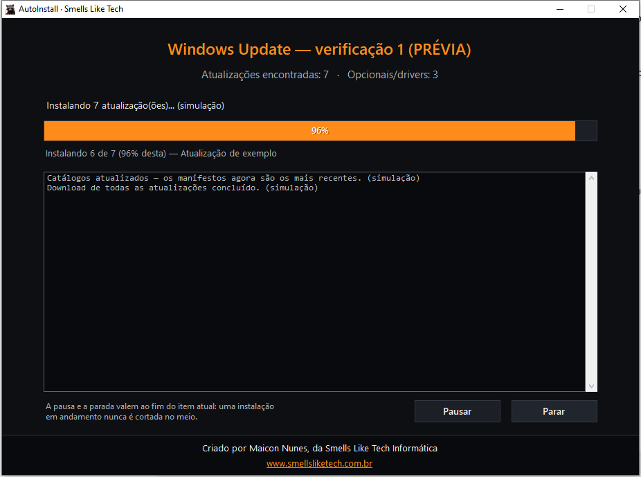
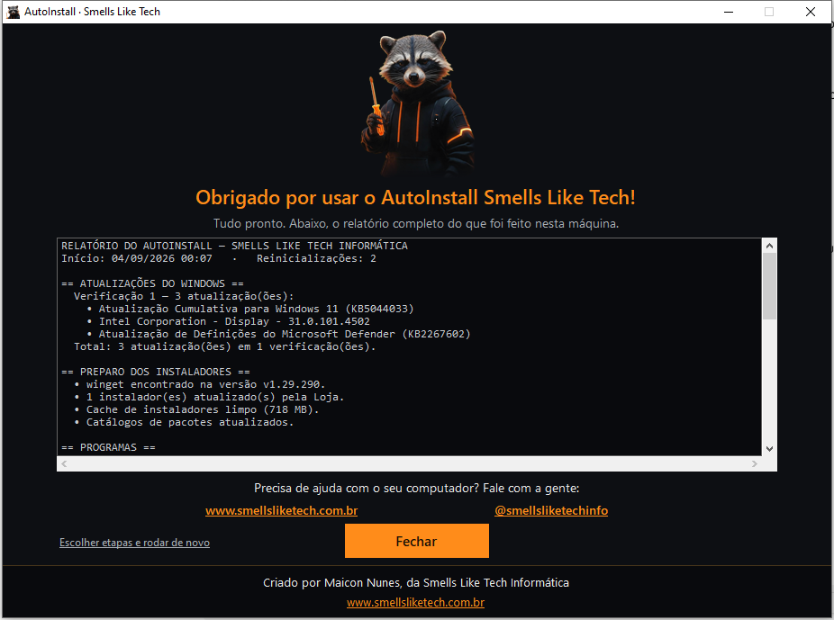

# AutoInstall — Smells Like Tech

Aplicação para automatizar o pós-formatação de computadores com Windows 10/11.

O técnico escolhe o que deseja executar em uma única tela e o programa cuida de atualizações, instalações, reinicializações e retomada do processo.


## O que automatiza

### Windows Update

- atualizações obrigatórias e opcionais;
- drivers;
- Microsoft Update;
- instalação de atualizações exclusivas separadamente;
- reinicialização automática quando necessária;
- retomada do ponto salvo após o logon;
- novas rodadas até não restarem atualizações ou atingir o limite de segurança.

### Preparo dos instaladores

Executado antes de qualquer instalação, porque instalador desatualizado é a
maior causa de falha:

- atualização do winget pela API da Microsoft Store;
- atualização do cliente da Loja, de que depende a fonte `msstore`;
- `winget source update` para renovar o catálogo local de manifestos;
- recarga do PATH do processo a partir do registro;
- limpeza do cache de instaladores em `%TEMP%\WinGet`.

O catálogo de manifestos é o ponto crítico: quando o fabricante republica o
instalador, o hash em cache fica defasado e a instalação falha com
`0x8A150011`. Renovar o catálogo antes resolve a causa; o *fallback* por
`--ignore-security-hash` continua como segunda linha de defesa.



### Instalação de programas

Catálogo por categorias com múltiplas estratégias de instalação:

- winget;
- Microsoft Store;
- instalador oficial;
- script oficial do fabricante;
- Office Deployment Tool.

A instalação é validada pelo estado real do sistema, e não apenas pelo código de saída do instalador.

### Atualização do software instalado

- `winget upgrade --all`;
- atualizações dos aplicativos da Microsoft Store;
- múltiplas passadas quando necessário.

### Como a máquina fica no fim

Opção **"Sou ousado"**, marcada por padrão:

| | Marcado | Desmarcado |
| --- | --- | --- |
| Plano de energia | Desempenho máximo permanente: nada desliga, suspende ou hiberna | Equilibrado (padrão do Windows) |
| Protetor de tela | Faixas em 15 minutos | não altera |

O protetor existe por causa do plano: com a tela ligada para sempre, imagem
parada por horas marca o monitor. Ele resolve isso sem devolver a máquina ao
modo que desliga e suspende tudo.

A configuração do protetor é gravada no perfil de quem executou **e** nos
perfis reais carregados em `HKEY_USERS`. O programa roda elevado; quando a
elevação vem de uma conta de administrador diferente da que usa o computador,
só o `HKEY_CURRENT_USER` não bastaria.

## Stack

C# · .NET Framework · WinForms · Windows Update COM API · winget · Microsoft Store API · PowerShell

## Fluxo de execução

```text
Escolha
   │
   ├── Windows Update
   ├── Instalar programas
   ├── Atualizar programas existentes
   └── Sou ousado (como a máquina fica no fim)
             │
             ▼
    preparo dos instaladores
   (quando há algo a instalar)
             │
             ▼
       execução automática
             │
       reinicia se necessário
             │
       retoma do estado salvo
             │
             ▼
    energia e protetor de tela
             │
             ▼
          relatório
```

| Execução | Relatório |
| --- | --- |
|  |  |

## Algumas decisões técnicas

### Atualização sem interromper operações críticas

Pausar ou parar é respeitado entre itens. Um instalador em execução não é encerrado abruptamente.

### Persistência entre reinicializações

O estado da execução é salvo antes do reboot. Uma tarefa agendada reabre a aplicação e o processo continua do ponto correto.

### Office pelo ODT

O Microsoft 365 é instalado pelo Office Deployment Tool com configuração explícita e a presença real do Click-to-Run é verificada ao final.

### Estratégias de fallback

Quando uma via de instalação falha, o catálogo pode tentar outra fonte oficial definida para aquele programa.

## Como compilar

```bat
build.bat
```

O projeto utiliza o compilador do .NET Framework presente no Windows e gera um executável para uso em bancada.

## Uso

```text
AutoInstall.exe
AutoInstall.exe --resume
AutoInstall.exe --preview
```

`--resume` é usado pela retomada automática após reinicialização.

`--preview` demonstra as telas com dados fictícios. Não lê nem grava o estado
salvo, o log ou qualquer configuração da máquina.

## Autor

**Maicon Nunes** — Smells Like Tech Informática  
[GitHub](https://github.com/mikerock12) · [Site](https://www.smellsliketech.com.br)
