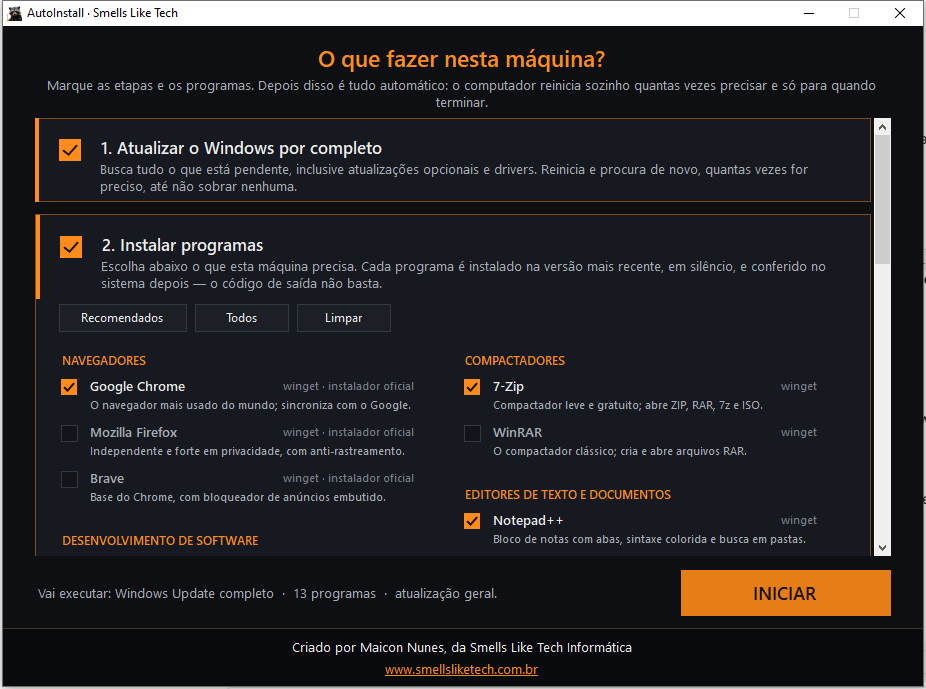
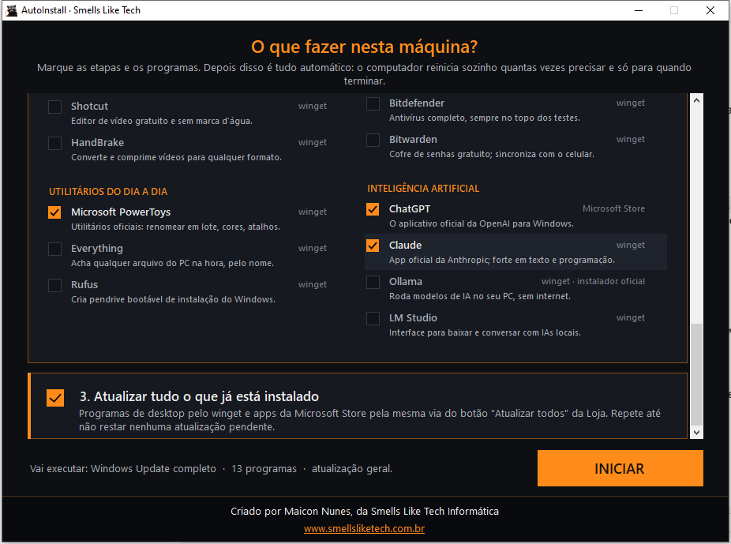
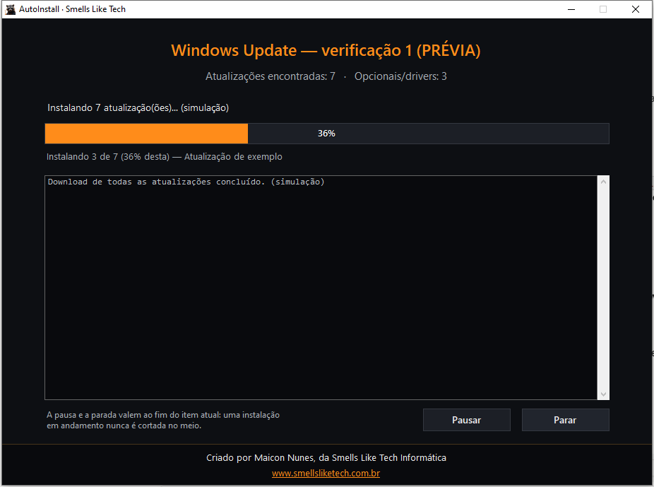
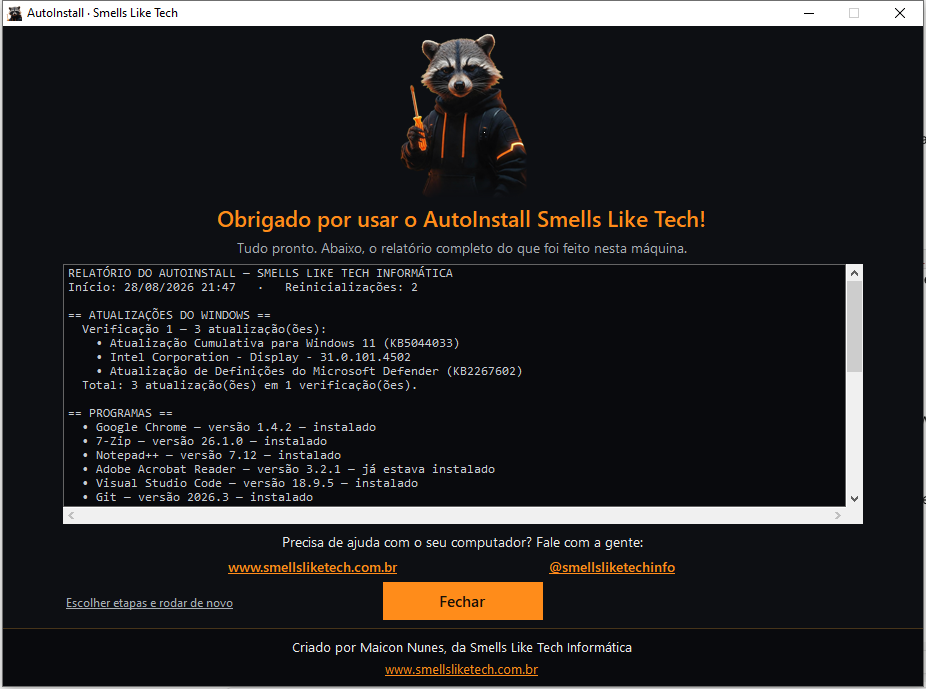

# AutoInstall — Smells Like Tech

Prepara uma máquina Windows 10 ou 11 do zero, sozinho. O técnico marca o que
quer em **uma tela só**, clica em INICIAR e vai fazer outra coisa: o programa
atualiza o Windows por completo, instala os programas escolhidos e atualiza
tudo o que já está na máquina — reiniciando o computador quantas vezes for
preciso e retomando de onde parou, até acabar.

Criado por Maicon Nunes · [www.smellsliketech.com.br](https://www.smellsliketech.com.br) · [@smellsliketechinfo](https://www.instagram.com/smellsliketechinfo)

---

## Como é

**1. Escolha do que fazer.** Três etapas, todas opcionais, e um catálogo de
programas por categoria — cada um com um resumo de uma linha e a indicação de
por onde ele vai ser instalado.





**2. Execução automática.** Percentual real, item por item, e o log corrido do
que está acontecendo. Dá para pausar e parar — sempre no fim do item atual.



**3. Relatório final.** Tudo o que foi feito, com as versões instaladas.



---

## As três etapas

### 1. Atualizar o Windows por completo

Busca **tudo** o que está pendente, incluindo **opcionais e drivers**, e também
o Microsoft Update (que traz Office e outros produtos da Microsoft). A tela
mostra quantas foram encontradas, quantas são opcionais/drivers, "baixando/
instalando X de Y" e o **percentual real** de download e de instalação, vindo
dos callbacks nativos do agente do Windows Update.

Depois de instalar, o computador reinicia (contagem regressiva de 60 s). Uma
tarefa agendada reabre o programa no logon, que **procura de novo e instala de
novo**, repetindo até não sobrar nenhuma atualização. Limite de segurança: 8
reinicializações.

> **Nada é pulado.** Muitas atualizações — drivers principalmente — se declaram
> como "podem pedir interação" (`CanRequestUserInput`) e mesmo assim instalam
> sozinhas numa boa. Todas entram na fila e a instalação roda com `ForceQuiet`,
> que suprime qualquer pedido de interação. Atualizações de impacto exclusivo
> (as que não podem dividir o lote) são instaladas uma a uma, depois do lote
> normal — juntas elas derrubariam a operação inteira. Se alguma realmente não
> instalar sem usuário, falha só ela, fica no relatório e a rodada seguinte
> tenta de novo.

### 2. Instalar programas

Nada vem pré-programado: o catálogo abaixo é oferecido em categorias e o
técnico marca o que aquela máquina precisa. O botão **Recomendados** deixa
marcado um conjunto de partida (as linhas com ★); **Todos** e **Limpar**
resolvem os extremos.

### 3. Atualizar tudo o que já está instalado

Duas frentes, porque nenhuma sozinha cobre a máquina inteira:

- **Apps da Microsoft Store** — aciona a mesma API do botão "Atualizar todos"
  da Loja (`AppInstallManager.SearchForAllUpdatesAsync`), com progresso por app
  e no total. A verificação roda **até 3 vezes**: o catálogo da Loja às vezes só
  lista uma atualização na segunda olhada — em campo, a primeira consulta voltou
  vazia e minutos depois havia atualização pendente.
- **Programas de desktop** — `winget upgrade --all`, repetido em passadas até
  não restar nenhuma pendência (máx. 5 passadas).

---

## O catálogo

★ = marcado pelo botão **Recomendados**.

#### Navegadores

| Programa | O que é | Instalação |
|---|---|---|
| **Google Chrome** ★ | O navegador mais usado do mundo; sincroniza com o Google. | winget + instalador oficial |
| **Mozilla Firefox** | Independente e forte em privacidade, com anti-rastreamento. | winget + instalador oficial |
| **Brave** | Base do Chrome, com bloqueador de anúncios embutido. | winget + instalador oficial |

#### Compactadores

| Programa | O que é | Instalação |
|---|---|---|
| **7-Zip** ★ | Compactador leve e gratuito; abre ZIP, RAR, 7z e ISO. | winget |
| **WinRAR** | O compactador clássico; cria e abre arquivos RAR. | winget |

#### Editores de texto e documentos

| Programa | O que é | Instalação |
|---|---|---|
| **Notepad++** ★ | Bloco de notas com abas, sintaxe colorida e busca em pastas. | winget |
| **Microsoft 365 (Word, Excel, PowerPoint)** | Word, Excel e PowerPoint em português, pela via oficial. | Office Deployment Tool |
| **LibreOffice** | Suíte de escritório gratuita; abre os formatos do Office. | winget |
| **Adobe Acrobat Reader** ★ | O leitor de PDF padrão do mercado, com assinatura digital. | winget |

#### Desenvolvimento de software

| Programa | O que é | Instalação |
|---|---|---|
| **Visual Studio Code** ★ | Editor de código da Microsoft, leve e cheio de extensões. | winget + instalador oficial |
| **Git** ★ | Controle de versão; obrigatório para trabalhar com GitHub. | winget |
| **Node.js LTS** | Runtime JavaScript com npm; base de todo projeto web. | winget |
| **Python 3** | Linguagem geral, forte em automação, dados e IA. | winget |
| **Inno Setup** | Cria instaladores .exe profissionais para Windows. | winget |
| **Windows Terminal** | Terminal com abas para PowerShell, CMD e WSL juntos. | winget + Microsoft Store |
| **PowerShell 7** | A versão atual do PowerShell, bem mais rápida. | winget + PowerShell |

#### Editores de imagem

| Programa | O que é | Instalação |
|---|---|---|
| **paint.net** ★ | Editor de imagens rápido, com camadas e efeitos. | winget |
| **GIMP** | Editor profissional gratuito, alternativa ao Photoshop. | winget |
| **Inkscape** | Desenho vetorial (SVG) para logos e ilustrações. | winget |
| **IrfanView** | Visualizador de imagens instantâneo, converte em lote. | winget |

#### Vídeo, áudio e codecs

| Programa | O que é | Instalação |
|---|---|---|
| **VLC Media Player** ★ | Toca qualquer vídeo ou áudio sem instalar mais nada. | winget |
| **K-Lite Codec Pack** ★ | Codecs de áudio e vídeo atualizados + o player MPC-HC. | winget |
| **OBS Studio** | Gravação de tela e transmissão ao vivo; padrão do meio. | winget |
| **Shotcut** | Editor de vídeo gratuito e sem marca d'água. | winget |
| **HandBrake** | Converte e comprime vídeos para qualquer formato. | winget |

#### Antivírus e segurança

| Programa | O que é | Instalação |
|---|---|---|
| **Malwarebytes** ★ | Remove vírus e adware que o antivírus comum deixa passar. | winget |
| **AdwCleaner** | Faxina adware, toolbars e sequestro de navegador. | winget |
| **Bitdefender** | Antivírus completo, sempre no topo dos testes. | winget |
| **Bitwarden** | Cofre de senhas gratuito; sincroniza com o celular. | winget |

#### Inteligência artificial

| Programa | O que é | Instalação |
|---|---|---|
| **ChatGPT** ★ | O aplicativo oficial da OpenAI para Windows. | Microsoft Store |
| **Claude** ★ | App oficial da Anthropic; forte em texto e programação. | winget |
| **Ollama** | Roda modelos de IA no seu PC, sem internet. | winget + instalador oficial |
| **LM Studio** | Interface para baixar e conversar com IAs locais. | winget |

#### Utilitários do dia a dia

| Programa | O que é | Instalação |
|---|---|---|
| **Microsoft PowerToys** ★ | Utilitários oficiais: renomear em lote, cores, atalhos. | winget |
| **Everything** | Acha qualquer arquivo do PC na hora, pelo nome. | winget |
| **Rufus** | Cria pendrive bootável de instalação do Windows. | winget |

### Por que várias vias de instalação

Cada programa traz uma ou mais vias, tentadas em ordem até a máquina provar que
ele está instalado:

| Via | Quando é usada |
|---|---|
| **winget** | O caminho padrão. Instalação silenciosa, versão mais recente do repositório oficial. |
| **Microsoft Store** | Para os apps que só existem como pacote da Loja (o ChatGPT, por exemplo). É o mesmo winget, na fonte `msstore`. |
| **PowerShell** | O script de instalação oficial do fabricante — o caso do `irm https://aka.ms/install-powershell.ps1`. O comando vai para um `.ps1` temporário, não para a linha de comando: esses scripts são cheios de aspas e chaves, que não sobrevivem inteiros a um `-Command`. |
| **Instalador oficial** | Último recurso, e só onde existe um endereço do próprio fabricante que sempre aponta para a versão mais recente (Chrome, Firefox, Brave, VS Code, Ollama). O download é conferido — tamanho e erro de rede — antes de qualquer coisa ser executada. |
| **Office Deployment Tool** | Só o Microsoft 365. Ver abaixo. |

**Quem decide se instalou é o sistema, não o código de saída do instalador.**
Depois de cada tentativa o programa consulta a máquina (`winget list` para
pacotes do winget e da Loja, o registro do Click-to-Run para o Office) para ver
se o programa está mesmo lá — o winget às vezes devolve erro com o programa
instalado, e o contrário também acontece.

Duas redes de proteção quando o winget falha:

1. **Hash desatualizado** (`0x8A150011`): acontece quando o fabricante
   republica o instalador no mesmo endereço e o manifesto do winget fica para
   trás — o Chrome é o caso clássico. **Só nesse caso** o programa libera
   `InstallerHashOverride` e repete com `--ignore-security-hash`. O download
   continua vindo do site oficial por HTTPS; o que se ignora é a conferência
   contra o manifesto, que está velho.
2. **A via seguinte do próprio programa** — instalador oficial ou script do
   fabricante, conforme o catálogo.

### O caso do Office

O pacote `Microsoft.Office` do winget baixa o `setup.exe` do Office Deployment
Tool, que **sem um XML não instala nada** — e ainda assim o winget devolve
sucesso. Era essa a falha vista em campo: o app dizia "instalado" e não havia
Word nem Excel na máquina. Aqui o mesmo `setup.exe` oficial é usado, porém com
XML explícito (Microsoft 365 Personal/Família, pt-BR) e, no fim, a instalação é
**conferida no registro** do Click-to-Run. Se a máquina já tiver Office, ele é
mantido.

---

## Energia

Antes de começar, o programa duplica o plano **Desempenho Máximo** (Ultimate
Performance; cai para *Alto Desempenho* se a edição do Windows não o expuser),
ativa e zera todos os timeouts: nunca desligar a tela, nunca suspender, nunca
hibernar, nunca desligar os discos. No final, restaura o **Equilibrado
(recomendado)** e apaga o plano temporário — inclusive quando o técnico manda
parar no meio.

## Pausar e parar

A tela de progresso tem **Pausar/Continuar** e **Parar**. Como quase tudo aqui
é instalação, os dois valem **no fim do item atual**: uma atualização ou um
instalador em andamento nunca é cortado no meio (é assim que se quebra um
Windows). O download do Windows Update, esse sim, é abortado na hora — o que já
baixou fica em cache. Ao parar, o programa restaura o plano de energia, remove a
tarefa de retomada e mostra o relatório do que deu tempo de concluir.

---

## Como compilar

```bat
build.bat
```

Usa só o `csc.exe` do .NET Framework 4.x que vem com o Windows — **não precisa
de Visual Studio**. Na primeira compilação, o script gera automaticamente:

- `lib\Interop.WUApiLib.dll` — interop da API COM do Windows Update, criada a
  partir do `wuapi.dll` do próprio sistema (`tools\make-interop.ps1`);
- `assets\guaxinim.png` — a imagem de exibição, gerada do recorte original;
- `icon.ico` — ícone gerado do mesmo recorte.

Saída: **`bin\AutoInstall.exe`** — arquivo único (imagem e script da Loja
embutidos), pronto para o pendrive. Requer administrador (manifesto).

Assinatura digital é opcional: defina `SLT_CERT_SUBJECT` antes de rodar o build.

### Logo

| Arquivo | O que é |
|---|---|
| `assets\guaxinim-origem.png` | O recorte original, **intocado** — é a fonte |
| `assets\guaxinim.png` | Versão de exibição, gerada; é a que vai no executável |

`tools\preparar-logo.ps1` gera a segunda a partir da primeira, fazendo duas
coisas que valem explicação:

- **Sangria de cor nas bordas.** O recorte veio de remoção de fundo verde, e os
  pixels 100% transparentes ainda guardam esse verde no RGB. Parado não se vê,
  mas a abertura desenha a imagem reduzida, e a interpolação mistura o RGB dos
  vizinhos **inclusive dos transparentes** — o verde vaza como franja em volta
  do personagem. A correção espalha a cor dos pixels opacos para dentro da área
  transparente, sem mexer no canal alfa.
- **Dissolução das bordas cortadas.** A base (e o trecho da lateral onde o
  personagem encosta na moldura) se dissolve no transparente: numa janela sem
  fundo, flutuando sobre a área de trabalho, um corte reto denuncia o recorte.

Para trocar a arte: substitua `guaxinim-origem.png`, **apague `guaxinim.png` e
`icon.ico`** e compile.

---

## Uso

| Comando | O que faz |
|---|---|
| `AutoInstall.exe` | Execução normal: tela de escolha, ou retomada da etapa salva |
| `AutoInstall.exe --resume` | Usado pela tarefa agendada após reiniciar (abertura curta) |
| `AutoInstall.exe --preview` | **Só demonstra as telas** com dados fictícios — não mexe em nada |

## Estado e logs

- `C:\ProgramData\SmellsLikeTech\AutoInstall\estado.json` — as escolhas da
  primeira tela, a etapa atual, as rodadas de update e os programas com versão.
  É o que permite retomar depois de cada reinicialização. Apague para recomeçar
  do zero.
- `C:\ProgramData\SmellsLikeTech\AutoInstall\log.txt` — log corrido de tudo.
- Tarefa agendada de retomada: `SmellsLikeTech AutoInstall` (removida
  automaticamente ao final; alternativa de reserva: chave RunOnce).

## Estrutura

| Arquivo | Papel |
|---|---|
| `src/Catalogo.cs` | O catálogo de programas: categorias, descrições e vias de instalação |
| `src/TelaSelecao.cs` | A primeira tela: etapas, atalhos e a grade de programas |
| `src/ControlesSelecao.cs` | Itens marcáveis desenhados no tema (o CheckBox do WinForms não aceita tema) |
| `src/MainForm.cs` | Janela única, rodapé fixo e a sequência de etapas |
| `src/Telas.cs` | Telas de progresso (pausar/parar), reinício e relatório final |
| `src/SplashGuaxinim.cs` | Abertura em janela sem moldura (UpdateLayeredWindow) |
| `src/Controles.cs` | Tema escuro/laranja, imagem com fade, barra de progresso |
| `src/ControleExecucao.cs` | Pausa e parada com pontos de checagem seguros |
| `src/AtualizadorWindows.cs` | Windows Update via COM com progresso real |
| `src/InstaladorApps.cs` | As vias de instalação, a conferência e o upgrade geral |
| `src/InstaladorOffice.cs` | Office pelo ODT oficial + conferência no registro |
| `src/LojaMicrosoft.cs` | Apps da Store via API AppInstallManager |
| `src/Energia.cs` | Planos de energia (powercfg) |
| `src/TarefaInicio.cs` | Tarefa agendada de retomada (schtasks + RunOnce) |
| `src/Estado.cs` | Persistência em JSON no ProgramData |
| `src/Executor.cs` | Execução de processos ocultos com captura de saída |

---

© 2026 Maicon Nunes — Smells Like Tech Informática.
